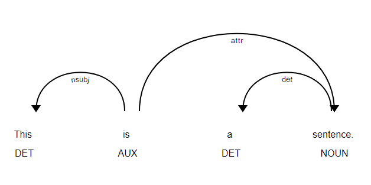

# Parser Analysis
This folder consists of data and code for analyzing code-switched data on the basis of [Dependency Parsers](https://spacy.io/usage/linguistic-features#dependency-parse). 

**Required Libraries**
1. [Jedi](https://pypi.org/project/jedi/0.10.2/) == 0.10
2. [Torch](https://pytorch.org) == 1.12.1
3. [pip](https://pip.pypa.io/en/stable/cli/pip_install/)  
4. [spacy](https://spacy.io/usage)
5. [wget](https://pypi.org/project/wget/)
6. [benepar](https://pypi.org/project/benepar/)
7. [deep-translator](https://pypi.org/project/deep-translator/)
8. [NLTK](https://www.nltk.org/install.html)
9. [Pandas](https://pandas.pydata.org/docs/getting_started/install.html)
10. [setuptools](https://pypi.org/project/setuptools/)
11. [wheel](https://pypi.org/project/wheel/)

## Dependency Parser
It is the process to analyze the grammatical structure in a sentence and find out related words as well as the type of the relationship between them.

We are collecting code-switching stats based on the relations between words like as shown above "This" and "is" have a relationship of "nsubj", we include this information in our analysis and detect the conversion rate of every relationship.

One of the main problem with this method is that dependency parsers only exist for monolingual sentences like [Dependency Parsers](https://spacy.io/usage/linguistic-features#dependency-parse) this is only for english.

### Parsing for Code-Switched sentences
Since, Code-switching is a speaker dependent, there are no set of rules which can define grammar of a multilingual conversation. 

Firstly, we take a utterance from conversational data and convert it to english using [Deep-Translator](https://pypi.org/project/deep-translator/). Then, we take an utterance and divide it among the english and malay parts of utterances, storing each part in an array for both the languages. 

After that we go through the english part and store the relationship data of those words. 

The main issue is the malay utterances it has the follwing problems:
- **Direct translation** of words are not necessarily in the sentence
    To tackle this we used ***lemmatization*** so, that if root form of the word is in sentence at that point, then we can add it to stats.
- **Combination of several words** have different meaning from when taken individually
    Instead of translating word by word, we did it part by part meaning if a sentence has 4 words in malay together then we translate them together and then include those in the stats.

"Parser_based_stats.ipynb" generates the "Parser Analysis.xlsx" which contains the Code mixing index for every parser relation.  
